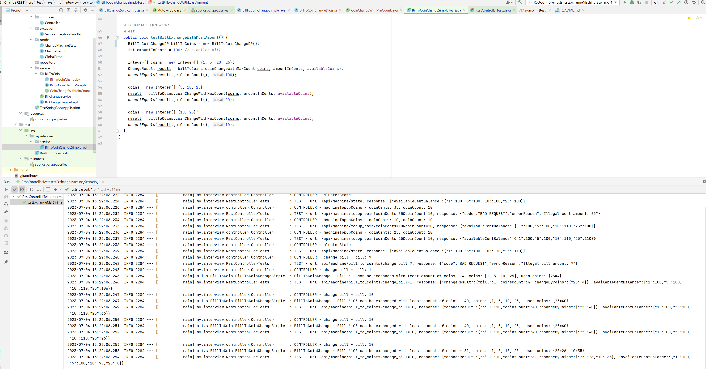

REST API to emulate ChangeToken functionality 

API examples:
- /api/machine/init?coinCount=100
- /api/machine/state
- /api/machine/topup_coin?coinCents=25&coinCount=10
- /api/machine/bill_to_coints?change_bill=1

How to run tests:
1. From command line, will run test to have predefined output in logs - mvn clean install   
2. From IDE (IDEA) - run /test/RestControllerTests.testExchangeMachine_Scenario_1() test
3. from Postman - run APIs in Postman

Run test from IDEA example:
@Test
public void testExchangeMachine_Scenario_1() throws Exception {
int coinsCount = 100;

    // Machine Init - testApiMachine_Init(int size)
    testApiMachine_Init(coinsCount)
        .andExpect(jsonPath("$.availableCentBalance.1").value("100"))
        .andExpect(jsonPath("$.availableCentBalance.5").value("100"))
        .andExpect(jsonPath("$.availableCentBalance.10").value("100"))
        .andExpect(jsonPath("$.availableCentBalance.25").value("100"));
    // Machine State - testApiMachine_State()
    testApiMachine_State();

    // TopupCoins - testApiMachine_Topup(int coinCents, int coinCount)
    testApiMachine_Topup(35, 10)
            .andExpect(status().is4xxClientError());
    testApiMachine_Topup(10, 10)
            .andExpect(status().isOk())
            .andExpect(jsonPath("$.availableCentBalance.10").value("110"));
    testApiMachine_Topup(25, 10)
            .andExpect(status().isOk())
            .andExpect(jsonPath("$.availableCentBalance.25").value("110"));
    testApiMachine_State();

    // exchange bill - testApi_exchangeBill()
    testApi_exchangeBill(7).andExpect(status().is4xxClientError());
    // TODO verify recursive
    //testApi_exchangeBill(1).andExpect(status().isOk());

    testApiMachine_State();
}

